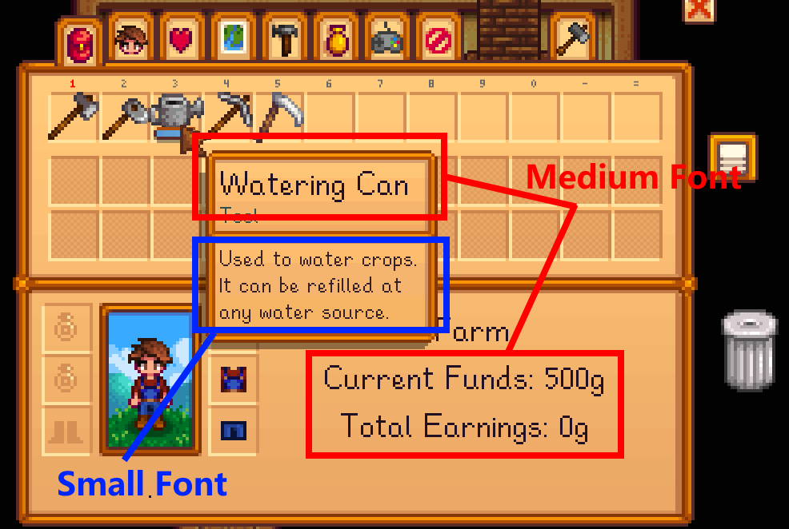
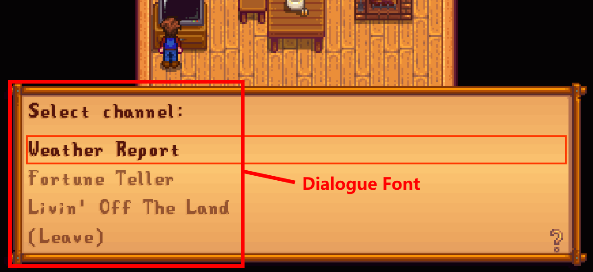

#### English | [中文](./README-zh.md)

# Font Settings
This mod:
*	Provides a common font interface. You can:
	- Change font size.
	- Pick various fonts.
	- Align text spacing.
	- Recolor text and text shadow.
	- Select character ranges.
	- Export fonts into xnb or readable files.
	- and so on...

## Table of Contents
- [Installation](#installation)
- [Usage](#usage)
  - [Font Types in Game](#font-types-in-game)
- [Configuration](#configuration)
- [Compatibility](#compatibility)
  - [Conflict with SpriteMaster](#conflict-with-spritemaster-mod)
- [For Modders](#for-modders)
  - [Edit mod assets](#edit-mod-assets)
  - [Create a Font Settings content pack](#create-a-font-settings-content-pack)
- [Troubleshooting](#troubleshooting)
  - [Forever applying font change. Sometimes with high CPU usage.](#forever-applying-font-change-sometimes-with-high-cpu-usage)
  - [SMAPI says "Multiple mods want to provide the 'xxx' asset..."](#smapi-says-multiple-mods-want-to-provide-the-xxx-asset)
- [Help & Feedback](#help--feedback)
- [Release Notes](#release-notes)

## Installation

1. Install [SMAPI](https://smapi.io/).
2. Download this mod from [Nexusmods](https://www.nexusmods.com/stardewvalley/mods/12467) and install. Mod files are shown as follows:

<table>
	<thead>
		<tr>
			<th>Mod file(s)</th>
			<th>Is required</th>
			<th>Description</th>
			<th>Install location</th>
		</tr>
	</thead>
	<tbody>
		<tr>
			<td><em>Font Settings x.x.x.zip</em></td>
			<td>√</td>
			<td>Main file</td>
			<td>Unzip and put into <em>Mods</em> folder.</td>
		</tr>
		<tr>
			<td><em>vanilla font file for Chinese</em></td>
			<td></td>
			<td rowspan=4>These are font files game uses for each language. Download if you want to keep original font but with size/spacing/linespacing change.</td>
			<td rowspan=4>Unzip and put into <strong>this mod's</strong> <em>assets/fonts</em> folder, or simply install the ttf to your pc.</td>
		</tr>
		<tr>
			<td><em>vanilla font file for Chinese (< 1.6.4)</em></td>
			<td></td>
		</tr>
		<tr>
			<td><em>vanilla font file for Japanese</em></td>
			<td></td>
		</tr>
		<tr>
			<td><em>vanilla font file for Korean</em></td>
			<td></td>
		</tr>
	</tbody>
</table>

3. Done!


## Usage
Two ways to open font settings menu:
1. Click the font button in title menu (the one with an uppercase 'A').
2. HotKey (default `LeftAlt + F`, to edit see [Configuration](#configuration)).

In the menu, configure the fonts, then click OK, your font is set!

### Font Types in Game
In game there're mainly three font types: **Small**, **Medium**, **Dialogue** font. You need to configure them seperately.

- Small Font: Used for item descriptions, tooltips.
- Medium Font: Bigger one. Used for item names, quest paragraphs, options.
- Dialogue Font: Stored in `Content/LooseSprites/font_bold`. Used for titles and dialogues.

 


#### Some Notes
* All the fonts available are from your computer. Current supported types are TrueType (.ttf, .ttc), OpenType (.otf, .otc, .ttf, .ttc).


## Configuration

Compatible with [Generic Mod Config Menu](https://www.nexusmods.com/stardewvalley/mods/5098) and [GMCM Options](https://www.nexusmods.com/stardewvalley/mods/10505)!

| Field	| Description | Notes |
| --- | --- | --- |
| OpenFontSettingsMenu | Keybind to open font menu, default `LeftAlt + F`. | |
| DisableTextShadow | Whether to close text shadow, default `false`. | |
| TextColor | Configues game most common text color, default `R=34, G=17, B=34`. | Install [GMCM Options](https://www.nexusmods.com/stardewvalley/mods/10505) for better color picker UI. |
| TextColorDialogue | Configues dialogue text color, default `R=86, G=22, B=12`. | ^ |
| ShadowColorGame1 | Configues game most common text shadow color 1, default `R=206, G=156, B=95`. | ^ |
| ShadowColorUtility | Configues game most common text shadow color 2, default `R=221, G=148, B=84`. | ^ |
| EnableLatinDialogueFont | Whether to enable custom dialogue font in latin languages, default `true`. **When there comes mod conflicts, turn it off for better compatibility.** | |
| EditMode | If checked, edit mode, or load mode. Edit mode enhances mod compatibility, avoids conflicts when multiple mods load same font, default `true`. | |
| EditPriority | Priority to edit fonts. The large the value, the later fonts get edited.<br>Range: [-2147483648, 2147483647]<br>Default `0`. | |
| ExampleText | Text for font samples. Keep it empty and mod will use built-in text. Otherwise set your own. | |
| MinFontSize | Min reachable value of the font size UI control, default `1`. | |
| MaxFontSize | Max reachable value of the font size UI control, default `100`. | |
| MinSpacing | Min reachable value of the spacing UI control, default `-10`. | |
| MaxSpacing | Max reachable value of the spacing UI control, default `10`. | |
| MinLineSpacing | Min reachable value of the line spacing UI control, default `1`. | |
| MaxLineSpacing | Max reachable value of the line spacing UI control, default `100`. | |
| MinCharOffsetX | Min reachable value of the x-offset UI control, default `-50`. | |
| MaxCharOffsetX | Max reachable value of the x-offset UI control, default `50`. | |
| MinCharOffsetY | Min reachable value of the y-offset UI control, default `-50`. | |
| MaxCharOffsetY | Max reachable value of the y-offset UI control, default `50`. | |
| MinPixelZoom | Min reachable value of the pixel zoom UI control, default `0.5`. | |
| MaxPixelZoom | Max reachable value of the pixel zoom UI control, default `5`. | |

## Compatibility:
Lastest version works with Windows, MacOS, Linux.

### Conflict with SpriteMaster mod
Condition: SpriteMaster version > 0.14.0, FontSettings version unlimited.<br/>
Symptom: Changes made to fonts do not apply, game becomes laggy, high cpu, etc.<br/>
**Solution**: In the configuration menu, go to `SpriteMaster > Advanced Settings > Extras.OpenGL`, uncheck `Enabled` and `OptimizeTexture2DSetData`, and restart the game.<br>

<small>(Test environment: FontSettings 0.9.0, SpriteMaster 0.15.0-beta.16.0)</small>


## For Modders
### Edit Mod Assets
Textures for this mod are stored in the `FontSettings/assets` folder. To edit them, you may:
* For own use, draw your own version and replace the texture file. Your own texture must be same size and filename as original one.
* For shared use, use [Content Patcher](https://www.nexusmods.com/stardewvalley/mods/1915). Each png file is an asset entry. Its name formats as `Mods/Becks723.FontSettings/<filename>`.

	e.g. to edit `delete.png`, add this to json.
	```js
	{
		"Action": "EditImage",
		"Target": "Mods/Becks723.FontSettings/delete",
		"FromFile": "path/to/yourtexturefile.png"
	}
	```

### Create a Font Settings content pack
Modders can create font packs by editing some json files. See [Font Settings pack guide](./docs/font-pack-guide.md) for more info.

## Troubleshooting
### Forever applying font change. Sometimes with high CPU usage.
That's because of SpriteMaster, another mod. But thankfully, they provide some settings to solve this issue. See [Compatibility - Conflict With SpriteMaster](#conflict-with-spritemaster-mod) for solution.

### SMAPI says "Multiple mods want to provide the 'xxx' asset..."
Here runs into the case when multiple mods load same font. In most cases, those UI interface mods do this.<br>
So, **to use Font Settings fonts**, you have these solutions:
- Remove the conflicted mods, directly.
- Since most UI mods use Content Patcher, edit their content JSON files to stop their font(s). This assumes you have CP knowledge.
- Font Settings also has options for compatibility: `EditMode`, `EditPriority` in [Cofiguration](#configuration). Mostly, you open EditMode, then increase EditPriority value, to delay the edits.

And, **to use other mods' fonts**, you have these solutions:
- In UI, uncheck 'Enabled' of target font.

## Help & Feedback:
### Where to feedback/ask for help
1. At [Nexus modpage POSTS tab](https://www.nexusmods.com/stardewvalley/mods/12467?tab=posts).
2. At [Discord](https://discord.gg/stardewvalley). Ping _@becks723_ anytime.

### Report a bug
1. At [Nexus modpage BUGS tab](https://www.nexusmods.com/stardewvalley/mods/12467?tab=bugs).
2. At [Github issues](https://github.com/Becks723/StardewMods/issues).


## Release Notes
#### 0.14.1 - 2024-05-07
- Fix dialogue font not changing under some latin languages.
- Add a 'x' suffix to the integer value of 'pixel zoom' option, for better understanding.
- Roll back vanilla Chinese font config.

#### 0.14.0 - 2024-04-28
- Adapted to Stardew Valley 1.6.6.
- Add arrows to sliders for precise adjustment.
- Fix under some languages dialogue font need to ok twice to apply changes.
- Compat for latest Toolbar Icon interface.

#### 0.13.0 - 2024-04-20
- Adapted to Stardew Valley 1.6.4. Mainly Chinese font changes.

#### 0.12.5 - 2024-04-19
- Adapted to Stardew Valley 1.6.

#### 0.12.4 - 2023-10-11
- Fix a bug where you cannot Save as new preset.

#### 0.12.3 - 2023-10-10
- Adds Portuguese translation. (Thanks to [Si0nk0b](https://www.nexusmods.com/users/142546813))
- Refactors config related + GMCM.
  - Change color rule. AABBGGRR (hexadecimal) -> R G B A (decimal).
  - Change some items default value, docs and range.
    <details>
	  <summary>Expand</summary>

      - EditMode default `false` -> `true`。
      - MinFontSize docs improved; default `5` -> `1`。
      - MaxFontSize docs improved; default `75` -> `100`。
      - MinLineSpacing docs improved; default `5` -> `1`。
      - MaxLineSpacing docs improved; default `75` -> `100`。
      - MinCharOffsetX docs improved; default `-10` -> `-50`。
      - MaxCharOffsetX docs improved; default `10` -> `50`。
      - MinCharOffsetY docs improved; default `-10` -> `-50`。
      - MaxCharOffsetY docs improved; default `10` -> `50`。

	 </details>

#### 0.12.2 - 2023-08-24
- Fix an issue where partof/all characters are missing from font bitmap, and in worst case violates memory and crashes game.

#### 0.12.1 - 2023-08-04
- Fix text becomes invisible after applied changes (**only happened to first-time users in 0.12**). Users encountered this bug may:
  1. Update to 0.12.1.
  2. Run `local data --clear` command in SMAPI console.

#### 0.12.0 - 2023-07-31
- New features:
  - Export. Lets you export font as xnb or normal files.
  - Color settings. Both text and text shadow color. See color related configs in [Configuration](#configuration).

- Improvements:
  - Adds version control to content pack ([`Format` field](./docs/font-pack-guide.md#format)).
  - Adds `EditMode` and `EditPriority` to reduce mod conflicts.
  - `DisableTextShadow` covers more locations.
  - Docs improved. Adds a [Troubleshooting](#troubleshooting) topic.

- Bugfixes:
  - Fix line spacing not actually applied to dialogue font.
  - Centers UI menus after window resized.

#### 0.11.4 - 2023-07-16
- Fix bugs related to content pack.

#### 0.11.3 - 2023-07-15
- Fix UI drop down randomly returns to top.
- Fix bugs in preset interface.
- Fix font files included in a font pack being ignored.

#### 0.11.2 - 2023-07-11
- Fix dialogue font becomes smaller than vanilla if `Enabled` not checked.
- Fix some special characters (such as icons) in dialogue font scale inproperly, in most case much smaller.

#### 0.11.1 - 2023-06-27
- Hotfix: Fix error when trying to open font menu for some first time users. **Update recommanded!**

#### 0.11.0 - 2023-06-26
- [Content pack](#create-a-font-settings-content-pack) support.

#### 0.10.3 - 2023-06-19
- Adds Russian translation. (Thanks to [h4man](https://www.nexusmods.com/stardewvalley/users/100380428))

#### 0.10.2 - 2023-06-05
- Fix a menu crash deleting a font preset.
- Optimize UI drop down under a large data set. Delete `SimplifiedDropDown` option added since [0.8](#080---2023-04-02).
- Optimize some Russian glyphs outline.

#### 0.10.1 - 2023-05-16
- Adds back some missing latin characters.

#### 0.10.0 - 2023-05-15
- Supports dialogue font in latin languages.
- Sample text now aligns better.
- Adds more log info for troubleshooting.
- Misc bugfixes.

#### 0.9.1 - 2023-04-29
- Fix no response pressing "Save As New Preset" button.
- Fix you cannot delete a preset.

#### 0.9.0 - 2023-04-18
- Add support for [Toolbar Icons](https://www.nexusmods.com/stardewvalley/mods/11026).
- You can customize this mod's textures (See [edit mod assets](#edit-mod-assets) section).
- Add a "Reset Font" option into UI, for restoring vanilla font.
- Improve font change effects when you select "keep original" (all common characters done).
- Improve font settings menu UI slightly.

#### 0.8.1 - 2023-04-02
- Fix error when select font after refreshing fonts.
- Fix font not reload until ok is pressed the second time.

#### 0.8.0 - 2023-04-02
- Some performance ups.
	- Speed up menu opening.
	- Reduce game not resposing times.
	- Optimized UI drop down options. See `SimplifiedDropDown` option in [configure](#configuration) section.
- Finally remove font settings menu from main game menu.
- Bugfixes.

#### 0.7.3 - 2023-03-01
- Fix dialogue font's characters incomplete/clipped render.
- Fix in some case cannot click ok button.

#### 0.7.2 - 2023-02-20
- Adds a font button into title menu. You can find it at lb corner, appear as an uppercase 'A'.
- Now supports custom language.
- Bugfixes.

#### 0.7.1 - 2023-02-14
- Slim mod file. Move those vanilla font file (assets/fonts) to optional mod file.
- Improve font change effects when you select "keep original". (all languages now support, except hu, ru, tr)
- Bugfixes.

#### 0.7.0 - 2023-02-06
- Improvements:
	- Display UI sliders' value.
	- Improve font change effects when you select "keep original". (current cjk)

- Bugfixes:
	- Fix a major bug where all fonts get lost after returning to title (or anyone invalidating it).
	- Fix a bug where everytime game launches, 1. ExampleText gets cleared, 2. PixelZoom is set to 1.0.
	- Add back the refresh button.

- Compatibility:
	- Drop 0.2 migration.

#### 0.6.2 - 2023-01-05
- Fix a bug where Dialogue font failed to set when 'Enabled' is not checked.

#### 0.6.1 - 2023-01-03
- Hotfix: In English no effect changing fonts.