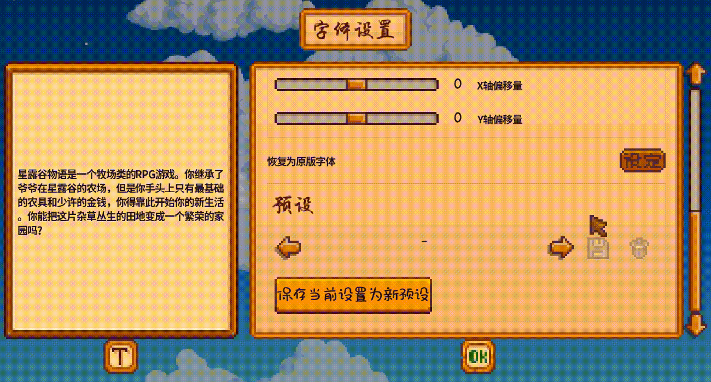

#### [English](./font-pack-guide.md) | 中文

# <small>[字体设置](https://www.nexusmods.com/stardewvalley/mods/12467)</small>：字体包制作教程

## 目录
- [字体包概述](#字体包概述)
- [制作字体包](#制作字体包)
  - [文件夹结构](#文件夹结构)
  - [content文件](#content文件)
  - [manifest文件](#manifest文件)
- [历史变动]()
- [附录](#附录)
  - [语言代码一览](#语言代码一览)
  

## 字体包概述
字体包是[字体设置模组](https://www.nexusmods.com/stardewvalley/mods/12467)的内容包（content pack），通过[json](https://en.wikipedia.org/wiki/JSON)格式声明一组字体设置，可作为模组发布。在游戏中转化为**预设**（图1）。

|  |
| :-: |
| 图1：字体包以预设的形式显示。|

## 制作字体包
### 文件夹结构
继承了大部分内容包的传统。
<pre>
根文件夹
  /*content.json<a href="#con"><sup>1</sup></a>
  /*manifest.json<a href="#man"><sup>2</sup></a>
  /i18n
    /default.json
    /zh.json
    /……
  /somefontfile.ttf
  /somecharfile.txt
  /……
</pre>

<small>
<p>带 * 号的为必需文件。</p>
<p id="con">1. 核心文件，储存所有的字体信息。确保文件名没有拼错。</p>
<p id="man">2. 该字体包的模组信息。确保文件名没有拼错。</p>
</small>

### content文件
储存字体包的内容，基本上你大部分的时间会花在编辑此文件上。

包含一个[版本声明](#format)和一组的[字体](#字体设置)。

#### Format
声明此字体包的版本，用于自动兼容至最新版本。填截止到你制作时的[最新版本](../README-zh.md#更新日志)就行了。

#### 字体设置
表示一组字体的设置项。

| 设置项 | 中文名 | 类型 | 描述 | 备注
| -- | -- | -- | -- | -- |
| Name | 名称 | `string` | 该组设置的名称。支持[翻译](#翻译i18n)。 | |
| Notes | 说明 | `string` | 该组设置的介绍，可短可长。支持[翻译](#翻译i18n)。 | |
| FontFile | 字体文件 | `string` | 使用的字体。文件路径表示，你可以指定完整路径，也可以指定相对路径，最短到文件名。**路径越长，搜索字体越精确；反之越模糊。** 一般写文件名就好。<br/>另外，别人的电脑不一定有你的字体，你可能需要提供具体的ttf字体文件。 | |
| Index | 索引 | `int` | 字体集合中的索引。在字体文件是一个集合时（通常后缀名 .ttc/.otc），一个文件中包含多个字体，需要指定最终使用哪个字体。索引值由`0`开始，默认为`0`。 | |
| Type | 类型 | `string` | 字体在游戏中的类型。支持的值有：`small`, `medium`, `dialogue`，分别对应 小、中、对话字体。支持指定多个，需要用 `,` 隔开。 | |
| Language | 语言 | `string` | 支持哪种（些）语言。每种语言用其代码表示，详见[附录：语言代码](#语言代码一览)。支持指定多个，需要用 `,` 隔开。 | |
| Size | 大小 | `float` | 字体的像素大小。 | |
| Spacing | 字间距 | `float` | 相邻两个字符之间的像素距离。默认为`0`。 | |
| LineSpacing | 行间距 | `float` | 相邻两行之间的像素距离。默认为`0`。 | |
| OffsetX | X轴偏移量 | `float` | 字符在水平方向上的像素偏移量。默认为`0`。 | |
| OffsetY | Y轴偏移量 | `float` | 字符在垂直方向上的像素偏移量。默认为`0`。 | |
| PixelZoom | 缩放比例 | `float` | 绘制文字时的缩放比例，**仅对话字体**。如`2`表示放大到原来的两倍显示。 | |
| Character | 自定义字符范围 | `string` | 自定义字符范围，将覆盖原版的字符范围。详见[字符范围章节](#字符范围)。 | |
| CharacterAdd | 增加的字符 | `string` | 在原版字符范围的基础上，增加的字符范围。详见[字符范围章节](#字符范围)。 | |
| CharacterRemove | 移除的字符 | `string` | 在原版字符范围的基础上，移除的字符范围。详见[字符范围章节](#字符范围)。 | |
| DefaultCharacter | 默认字符 | `char?` | 当某一个字符缺失时，使用此字符代替。默认`'*'`。 | |
| Mask | 颜色蒙版 | `Color` | 给字体图上色。默认白色。

示例：
<details>
<summary>展开</summary>

一个黑体，32px，行间距为36，游戏内对应中字、中文，使用自定义字符的字体设置。
```json
{
  "Name": "宋体32px中体",
  "FontFile": "simhei.ttf",
  "Size": 32,
  "LineSpacing": 36,
  "Type": "medium",
  "Language": "zh",
  "Character": "字符范围.txt"
}
```

字符范围.txt：包含所有自定义字符。
```txt
毁旭如舅九奶婚妨嫌录灵巡刀好妇妈姆对参戏台劝观矣牟能难允驻驼马邓艰双线结顷红引……
```
</details>

#### 翻译（i18n）
所有支持翻译的设置项都可以用 `{{i18n: <key>}}` 的格式来表示翻译，其中 `<key>` 用i18n文件中对应的键代替。<br>
附：[SMAPI的i18n制作教程](https://stardewvalleywiki.com/Modding:Modder_Guide/APIs/Translation)

#### 字符范围
指定字符范围需要另建文件，这里称为字符文件。每个字符设置项对应一个字符文件，文件的相对路径作为设置项的值。

字符文件支持的格式：
- 简单文本：将所有字符一一罗列出来，后缀名.txt。

### manifest文件
所有SMAPI模组都必需的一个文件，储存该模组自身的信息（如名字、作者、版本号等）。格式和写法这里不多描述，详见[SMAPI的manifest教程](https://zh.stardewvalleywiki.com/%E6%A8%A1%E7%BB%84:%E5%88%B6%E4%BD%9C%E6%8C%87%E5%8D%97/APIs/Manifest)。
以下是一个示例用来参照：
```json
{
  "Name": "Your Project Name",
  "Author": "your name",
  "Version": "1.0.0",
  "Description": "One or two sentences about the mod.",
  "UniqueID": "YourName.YourProjectName",
  "UpdateKeys": [],
  "ContentPackFor": {
    "UniqueID": "Becks723.FontSettings"  // 这是字体设置的ID
  }
}
```

## 历史变动
记录所有对字体包格式的更改，用于更新时查阅。
#### 0.12.0
- 添加`Format`字段。在此版本之前的需要手动更新，不然无法读取。之后的版本都可以向上兼容。
- 添加两个设置：`DefaultCharacter`和`Mask`。

#### 0.11.0
- 首次引入。

## 附录
### 语言代码一览
**原版语言**
| 语言 | 代码 |
| --- | --- |
| 英语 | `en` |
| 德语 | `de` |
| 西班牙语 | `es` |
| 法语 | `fr` |
| 匈牙利语 | `hu` |
| 意大利语 | `it` |
| 日本语 | `ja` |
| 韩语 | `ko` |
| 葡萄牙语 | `pt` |
| 俄语 | `ru` |
| 土耳其语 | `tr` |
| 中文 | `zh` |

**模组（自定义）语言**

自定义语言的代码储存在其内容包（content.json）中，如：
```json
{
    "Format": "1.28.0",
    "Changes": [
        {
            "Action": "EditData",
            "Target": "Data/AdditionalLanguages",
            "Entries": {
                "Pathoschild.Esperanto": {
                    "ID": "Pathoschild.Esperanto",
                    "LanguageCode": "eo",  // >>>这里eo就是语言代码<<<
                    "ButtonTexture": "Mods/Pathoschild.Esperanto/Button",
                    "UseLatinFont": true,
                    "TimeFormat": "[HOURS_24_00]:[MINUTES]",
                    "ClockTimeFormat": "[HOURS_24_00]:[MINUTES]",
                    "ClockDateFormat": "[DAY_OF_WEEK] [DAY_OF_MONTH]"
                }
            }
        }
    ]
}
```
格式详见[自定义语言教程](https://stardewvalleywiki.com/Modding:Custom_languages)。