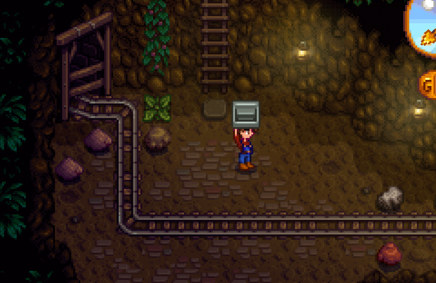
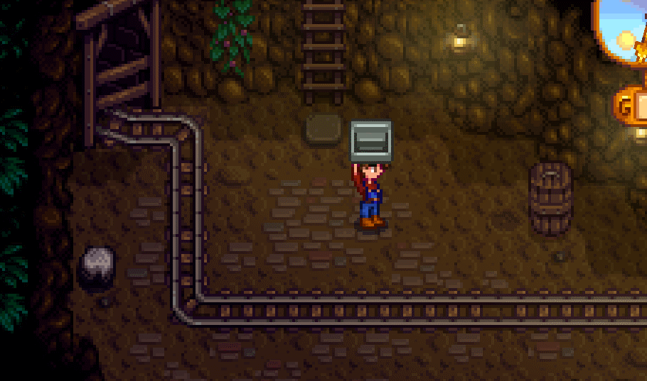

# Staircase Placement Fix
A mod to fix some mine tiles cannot place staircase.

## Installation

1. Install [SMAPI](https://smapi.io/).
2. Download this mod from [Nexusmods](https://www.nexusmods.com/stardewvalley/mods/13381). Unzip and put into **Mods** folder.
* Files with _(Android)_ prefix are Android versions.
3. Done!

## Usage
### Before this mod:
|  |
| :--: |
| For some special mine tiles, placing stairs can cause misalignment and even waste several of your stairs. |

### After this mod:
|  |
| :--: |
| Fixed! |

## Compatibility:
Lastest version works with Windows, MacOS, Linux, Android<small>(1.4 ok, 1.5 not test yet)</small>.

## Help & Feedback:

#### Where to feedback/ask for help
1. At [Nexus modpage POSTS tab](https://www.nexusmods.com/stardewvalley/mods/13381?tab=posts).
2. At [Stardew Valley Discord](https://discord.gg/stardewvalley). Ping me _@Becks723#7620_ anytime. I won't be always around but I'll check.

#### Report a bug
1. At [Nexus modpage BUGS tab](https://www.nexusmods.com/stardewvalley/mods/13381?tab=bugs).
2. At [Github issues](https://github.com/Becks723/StardewMods/issues).

## Release Notes
#### 1.0.1 - 2022-11-14
- Rename to "Staircase Placement Fix".
- Optimize.

#### 1.0.0 - 2022-08-13
- Initial release.